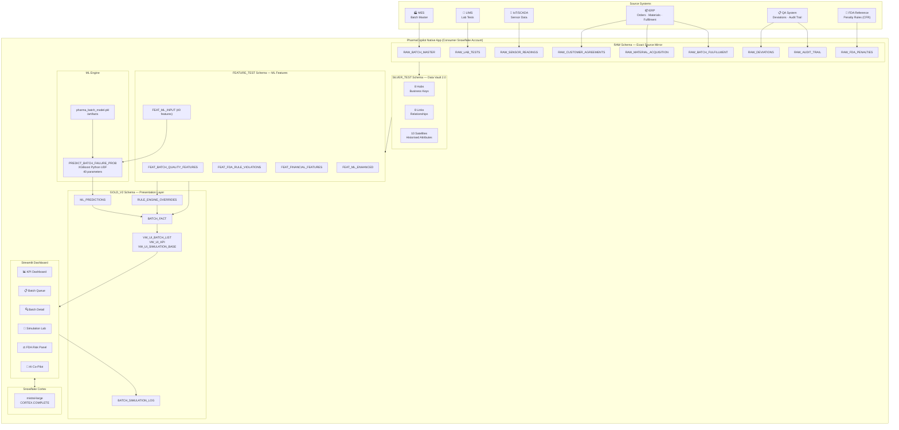
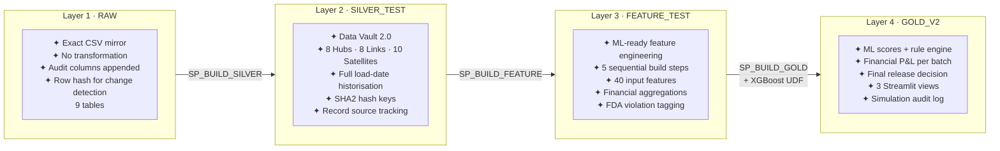
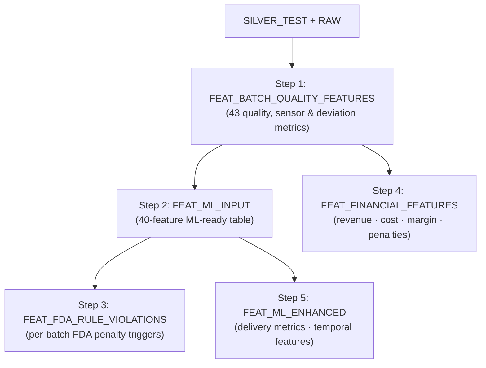
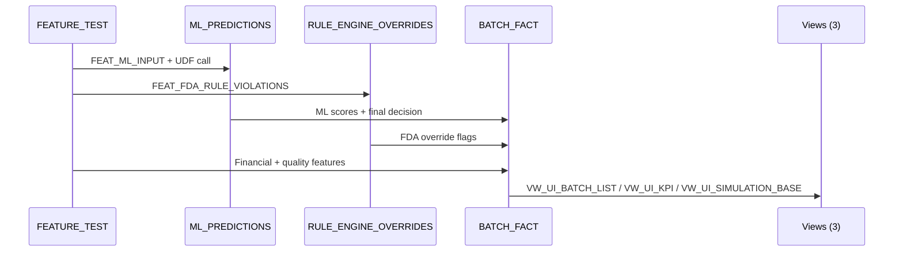
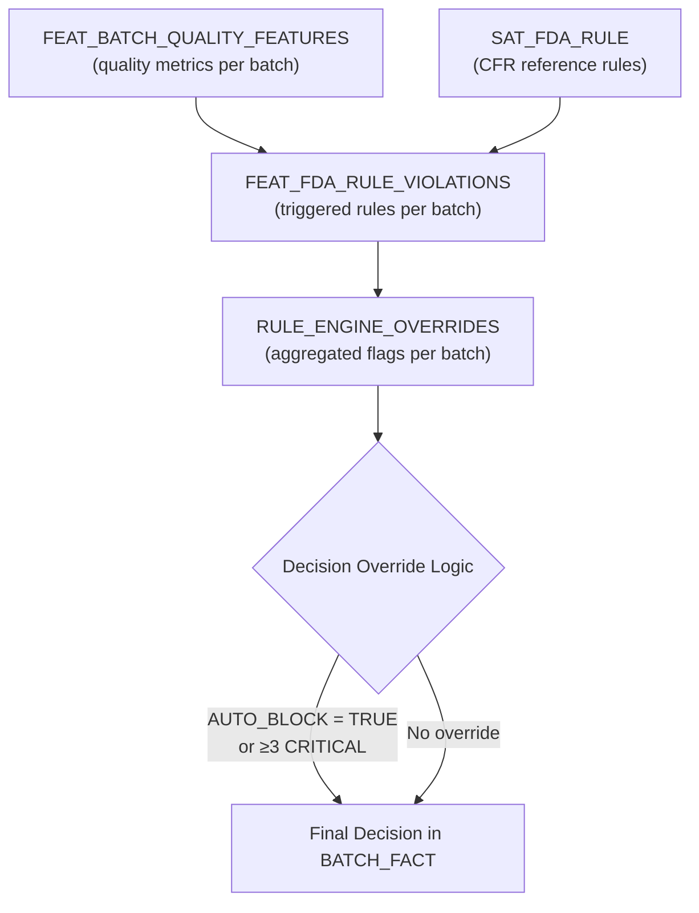
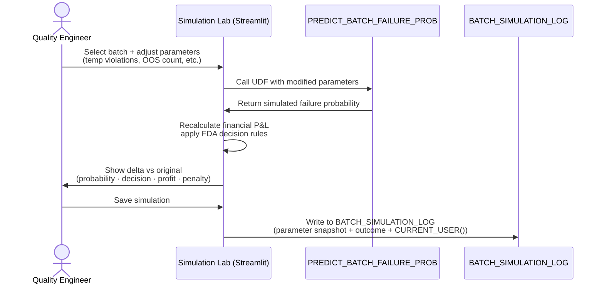

# PharmaCopilot — Pharmaceutical Manufacturing Intelligence

**Publisher:** *Synthlake Solutions PVTLTD*
**Category:** Healthcare & Life Sciences · Manufacturing Intelligence · Quality Management
**Snowflake Native App** · **Marketplace Ready** · **FDA 21 CFR Part 11 Ready**

---

> **PharmaCopilot** is an enterprise-grade Snowflake Native App that transforms pharmaceutical manufacturing data into real-time batch release decisions. Powered by XGBoost machine learning, a configurable FDA rule engine, and Snowflake Cortex AI, it gives quality assurance and manufacturing teams a single, audit-ready platform to predict batch failures, quantify regulatory risk, and model what-if interventions — all without moving data outside your Snowflake account.

---

## Table of Contents

1. [Business Problem](#1-business-problem)
2. [Product Overview](#2-product-overview)
3. [Key Features](#3-key-features)
4. [Architecture Overview](#4-architecture-overview)
5. [Data Pipeline Architecture](#5-data-pipeline-architecture)
6. [ML Prediction Engine](#6-ml-prediction-engine)
7. [FDA Rule Engine](#7-fda-rule-engine)
8. [Simulation Lab](#8-simulation-lab)
9. [AI Co-Pilot](#9-ai-co-pilot)
10. [Streamlit Dashboard](#10-streamlit-dashboard)
11. [Security Model](#11-security-model)
12. [Installation Guide](#12-installation-guide)
13. [Post-Install Configuration](#13-post-install-configuration)
14. [Supported Snowflake Features](#14-supported-snowflake-features)
15. [Regional Availability](#15-regional-availability)
16. [Limitations](#16-limitations)
17. [Troubleshooting](#17-troubleshooting)
18. [Support](#18-support)

---

## 1. Business Problem

Pharmaceutical manufacturers face a convergence of pressures that make batch release decisions among the most consequential — and risky — in any industry:

| Pressure | Impact |
|---|---|
| Regulatory complexity | FDA 21 CFR Parts 211, 212 mandate documented, auditable release decisions |
| Data fragmentation | Quality signals live across MES, LIMS, IoT/SCADA, ERP, and QA systems |
| Decision latency | Manual QA review cycles take days; market windows close in hours |
| Financial exposure | A single recalled batch can generate penalties exceeding $10M and Class I recall designation |
| Audit readiness | Every decision must be traceable, reproducible, and electronically signed |

Traditional approaches — spreadsheet-based QA review, siloed ERP dashboards, and reactive LIMS reporting — cannot synthesise multi-system signals fast enough or with the depth of analysis regulators now expect.

**PharmaCopilot solves this.** It ingests data from all manufacturing source systems, builds a harmonised quality intelligence layer inside Snowflake, and surfaces ML-scored, FDA rule-validated batch release decisions through an intuitive Streamlit interface — all within the consumer's own Snowflake account.

---

## 2. Product Overview

PharmaCopilot is a **Snowflake Native App** built on the Native App Framework. It runs entirely within the consumer's Snowflake account — no data leaves, no external services are called, and no infrastructure is managed.

### Core Components

| Component | Technology | Purpose |
|---|---|---|
| Data Pipeline | SQL · Data Vault 2.0 | RAW → Silver → Feature → Gold transformation |
| ML Engine | XGBoost · Snowpark Python UDF | Batch failure probability prediction |
| FDA Rule Engine | SQL · CASE logic | Regulatory override on top of ML output |
| Simulation Lab | Snowpark · Streamlit | What-If analysis with live UDF re-scoring |
| AI Co-Pilot | Snowflake Cortex · mistral-large | Natural language QA decision support |
| Dashboard | Streamlit in Snowflake | KPIs, batch drilldown, financial analytics |

### Compliance Posture

- **FDA 21 CFR Part 11** — electronic audit trail via `RAW_AUDIT_TRAIL` and `BATCH_SIMULATION_LOG`
- **Data Vault 2.0** — full Silver layer historisation with load date and record source
- **Snowflake Native App Framework** — no data egress; consumer retains full data sovereignty
- **Role-Based Access Control** — two application roles with principle of least privilege

---

## 3. Key Features

### 🔬 Intelligent Batch Release Scoring
XGBoost model trained on 40 quality, sensor, deviation, and temporal features produces a **failure probability score** and a **release score** for every batch. Hard safety rules guarantee sterility + endotoxin co-failures always score as REJECT regardless of ML output.

### ⚖️ FDA Rule Engine Overlay
Nine configurable FDA penalty rules (CFR references: 21 CFR 211.113, 211.165, 211.68 and others) evaluate each batch independently of the ML model. Critical violations override ML decisions — ensuring regulatory requirements are never traded off against statistical confidence.

### 💰 Financial Risk Quantification
For every batch, PharmaCopilot calculates committed revenue, material cost, gross margin, penalty exposure, and net profit under each possible decision (RELEASE / RETEST / HOLD / REJECT). Financial context is visible alongside quality scores at all times.

### 🧪 Simulation Lab (What-If Analysis)
Quality engineers can adjust any mutable parameter — temperature violations, OOS counts, deviation counts, process variance — and trigger a live XGBoost re-score without affecting production data. Every simulation run is written to an audit log.

### 🤖 AI Co-Pilot (Snowflake Cortex)
A context-aware chat interface backed by `SNOWFLAKE.CORTEX.COMPLETE` answers natural language questions about any batch. The Co-Pilot has access to live batch quality, FDA risk, and financial data and provides actionable recommendations grounded in current manufacturing state.

### 📊 Executive Dashboard
A multi-page Streamlit dashboard surfaces KPI strips, batch queue tables, trend analytics, deviation breakdowns, and FDA risk heat maps — designed for QA directors, plant managers, and regulatory affairs teams.

### 🏛️ Data Vault 2.0 Silver Layer
27 Data Vault objects (8 Hubs, 8 Links, 10 Satellites) provide full historisation of all source data, enabling regulatory retrospective analysis and supporting GxP audit requirements.

---

## 4. Architecture Overview



---

## 5. Data Pipeline Architecture

The pipeline follows a four-layer medallion architecture adapted for pharmaceutical GxP requirements. Each layer is schema-isolated. The pipeline is orchestrated by stored procedures and can be scheduled via Snowflake Tasks.

### Layer Map



### Layer 1: RAW Schema

**Purpose:** Exact, unmodified mirror of source system CSV files. No business logic applied.

| Table | Source System | Key Content |
|---|---|---|
| `RAW_BATCH_MASTER` | MES | Batch ID, product, plant, line, status, timing |
| `RAW_SENSOR_READINGS` | IoT/SCADA | Temperature, humidity, pressure, calibration status |
| `RAW_LAB_TESTS` | LIMS | Test results, OOS flags, analyst ID, approval chain |
| `RAW_DEVIATIONS` | QA System | Deviation type, severity, CAPA status, root cause |
| `RAW_AUDIT_TRAIL` | ERP/MES | Electronic audit trail (21 CFR Part 11) |
| `RAW_CUSTOMER_AGREEMENTS` | CRM/Contracts | Committed quantities, delivery deadlines, penalty clauses |
| `RAW_MATERIAL_ACQUISITION` | ERP Procurement | Material costs, supplier, purchase date |
| `RAW_FDA_PENALTIES` | FDA CFR Reference | Violation types, penalty ranges, recall class, hold days |
| `RAW_BATCH_FULFILLMENT` | ERP Dispatch | Delivery status, delay days, fulfilment quantities |

Every RAW table appends three audit columns: `_RAW_LOAD_TS`, `_SOURCE_FILE`, `_ROW_HASH`.

### Layer 2: SILVER_TEST Schema (Data Vault 2.0)

**Purpose:** Business-key–driven historisation. Every entity gets a SHA2 hash key; every attribute change is preserved with a load date and record source. Supports full retrospective regulatory audit.

**27 objects total:**

```
Hubs (8):     HUB_BATCH · HUB_PRODUCT · HUB_CUSTOMER · HUB_AGREEMENT
              HUB_SENSOR · HUB_LAB_TEST · HUB_DEVIATION · HUB_FDA_RULE

Links (8):    LNK_BATCH_PRODUCT · LNK_CUSTOMER_AGREEMENT · LNK_AGREEMENT_PRODUCT
              LNK_BATCH_AGREEMENT · LNK_BATCH_SENSOR · LNK_BATCH_LAB_TEST
              LNK_BATCH_DEVIATION · LNK_BATCH_FDA_RULE

Satellites (10): SAT_BATCH · SAT_PRODUCT · SAT_CUSTOMER · SAT_AGREEMENT
                 SAT_BATCH_FULFILLMENT · SAT_MATERIAL_COST · SAT_FDA_RULE
                 SAT_SENSOR · SAT_LAB_TEST · SAT_DEVIATION
```

### Layer 3: FEATURE_TEST Schema

**Purpose:** Derives all 40 ML input features plus FDA violation flags and financial metrics. Built in a strict sequential dependency order:



### Layer 4: GOLD_V2 Schema

**Purpose:** Final analytical layer combining ML predictions, FDA rule overrides, and financial context into a single `BATCH_FACT` table with three Streamlit-ready views.

**Build order:**



### Pipeline Orchestration

```
CALL APP_CONFIG.SP_RUN_FULL_PIPELINE();
```

This stored procedure calls `SP_BUILD_SILVER()` → `SP_BUILD_FEATURE()` → `SP_BUILD_GOLD()` in sequence. Each layer SP logs run status to `APP_CONFIG.PIPELINE_RUN_LOG`. The pipeline can be scheduled via a Snowflake Task pointing to `SP_RUN_FULL_PIPELINE()`.

---

## 6. ML Prediction Engine

### Model Summary

| Property | Value |
|---|---|
| Algorithm | XGBoost `XGBClassifier` |
| Framework | `sklearn.pipeline.Pipeline` with `ColumnTransformer` |
| Parameters | `n_estimators=400`, `max_depth=6`, `learning_rate=0.05` |
| Runtime | Snowpark Python UDF · Python 3.11 |
| Packages | `xgboost==1.7.6`, `scikit-learn==1.3.0`, `pandas==2.1.4`, `numpy==1.26.4`, `joblib==1.5.1` |
| Input features | 40 (4 categorical + 36 numeric) |
| Target | Binary: `BATCH_STATUS = 'RELEASED'` → 0, else → 1 |
| Evaluation | ROC-AUC (5-fold stratified cross-validation) |
| Artefact | `pharma_batch_model.pkl` · stored in `@<PKG_STAGE>/v1/artifacts/pharma_batch_model.pkl` |

### Feature Groups

| Group | Count | Examples |
|---|---|---|
| Categorical identity | 4 | `PRODUCT_TYPE`, `PLANT_ID`, `BATCH_SIZE_BUCKET`, `DURATION_BUCKET` |
| Lab quality | 12 | `PASS_RATE_PCT`, `OOS_COUNT`, `FAIL_RATE_PCT`, `STERILITY_FAIL_FLAG` |
| IoT / sensor | 8 | `TEMP_VIOLATION_COUNT`, `AVG_TEMP_DEVIATION_C`, `IOT_VIOLATION_DENSITY` |
| Deviation | 10 | `CRITICAL_DEVIATION_COUNT`, `WEIGHTED_DEVIATION_SCORE`, `DEVIATION_DENSITY` |
| Process / size | 3 | `BATCH_SIZE`, `BATCH_DURATION_HOURS`, `PROCESS_VARIANCE` |
| Temporal | 4 | `BATCH_START_HOUR`, `BATCH_START_DOW`, `IS_WEEKEND_BATCH`, `IS_NIGHT_SHIFT` |

### Decision Thresholds

ML failure probability is mapped to a release action using configurable thresholds stored in `APP_CONFIG.PIPELINE_CONFIG`:

| Failure Probability | ML Action | Configurable |
|---|---|---|
| ≤ 20% | **RELEASE** | `ML_FAILURE_THRESH_RELEASE` |
| 21% – 40% | **RETEST** | `ML_FAILURE_THRESH_RETEST` |
| 41% – 65% | **HOLD** | `ML_FAILURE_THRESH_HOLD` |
| > 65% | **REJECT** | derived |

### Hard Safety Rules (Override ML)

The following conditions trigger an immediate **REJECT** regardless of ML probability:

1. **Sterility + Endotoxin co-failure** (`STERILITY_FAIL_FLAG = 1` AND `ENDOTOXIN_FAIL_FLAG = 1`) — enforced inside the UDF handler before model inference
2. **FDA auto-block rule** — any active `AUTO_BLOCK_RELEASE = TRUE` violation in `FEAT_FDA_RULE_VIOLATIONS`
3. **≥ 3 critical FDA violations** in a single batch

### UDF Signature

The UDF is registered as `ML_CODE.PREDICT_BATCH_FAILURE_PROB` in a versioned schema and accepts 40 parameters. It returns a `FLOAT` in `[0.0, 1.0]` representing failure probability. The model is loaded from the bundled version artifacts (`/artifacts/pharma_batch_model.pkl`) on the first call per warehouse worker and cached for subsequent calls.

---

## 7. FDA Rule Engine

### How It Works

The rule engine runs independently of the ML model. It evaluates each batch against a configurable reference table of FDA penalty rules loaded into `RAW_FDA_PENALTIES` and promoted to `SILVER_TEST.SAT_FDA_RULE`.



### Included Penalty Rules

| Rule ID | CFR Reference | Violation Category | Key Trigger |
|---|---|---|---|
| FDA-PEN-001 | 21 CFR 211.165 | CRITICAL | Lab test failure |
| FDA-PEN-002 | 21 CFR 211.68 | MAJOR | Cold chain / temperature excursion |
| FDA-PEN-003 | 21 CFR 211.113 | CRITICAL | Sterility or critical deviation |
| FDA-PEN-005 | 21 CFR 211.192 | MAJOR | Uninvestigated deviation |
| FDA-PEN-009 | 21 CFR 211.167 | CRITICAL | Endotoxin / pyrogen failure |

Additional rules are seeded in `RAW_FDA_PENALTIES` and can be extended by the consumer's QA team without modifying application code.

### Rule Engine Outputs per Batch

| Field | Description |
|---|---|
| `HAS_AUTO_BLOCK_RULE` | 1 if any triggered rule has `AUTO_BLOCK_RELEASE = TRUE` |
| `FDA_VIOLATION_COUNT` | Total triggered rules |
| `FDA_CRITICAL_VIOLATIONS` | Count of CRITICAL category triggers |
| `FDA_MAJOR_VIOLATIONS` | Count of MAJOR category triggers |
| `TOTAL_ESTIMATED_PENALTY_USD` | Sum of estimated penalty mid-points |
| `REGULATORY_HOLD_DAYS` | Maximum hold days from triggered rules |
| `CRITICAL_CFR_REFERENCE` | Worst CFR reference triggered |

---

## 8. Simulation Lab

The Simulation Lab is PharmaCopilot's **What-If analysis engine**. Quality engineers can modify any mutable quality parameter for a batch and observe the downstream impact on ML score, release decision, and financial P&L — in real time, without touching production data.

### How It Works



### Mutable Parameters

| Parameter Category | Parameters |
|---|---|
| IoT / Sensor | Temperature violations, humidity violations, pressure violations |
| Lab Quality | Failed test count, OOS count, borderline count, pass rate % |
| Deviations | Critical deviation count, high deviation count |
| Process | Process variance |

### Audit Trail

Every simulation run is appended to `GOLD_V2.BATCH_SIMULATION_LOG` with:
- Timestamp and user (`CURRENT_USER()`)
- Full parameter snapshot before and after
- ML re-score, simulated decision, and financial delta
- Decision change flag (`DECISION_CHANGED`)
- Original decision for comparison

This log is **immutable from the application** (INSERT-only) and satisfies FDA 21 CFR Part 11 electronic record requirements for what-if analyses.

---

## 9. AI Co-Pilot

The AI Co-Pilot is an embedded natural language interface powered by `SNOWFLAKE.CORTEX.COMPLETE`. It gives QA teams the ability to ask questions about any batch in plain English and receive context-grounded answers.

### Capabilities

- **Batch context awareness** — the Co-Pilot receives live quality, FDA risk, and financial data for the selected batch as part of every prompt
- **Intent classification** — detects question type (quality, regulatory, financial, process) and tailors the response
- **Actionable recommendations** — responses include specific CFR-referenced corrective actions where applicable
- **Conversation continuity** — maintains message history within the session

### Example Queries

```
"Why is this batch recommended for HOLD?"
"What are the top 3 risk factors driving the failure probability?"
"What would happen to our P&L if this batch is rejected?"
"Which FDA penalty rules are triggered and what is the estimated exposure?"
"Recommend corrective actions for the temperature violations."
```

### Technical Configuration

| Property | Value |
|---|---|
| Model | `mistral-large` (Cortex) |
| Invocation | `SELECT SNOWFLAKE.CORTEX.COMPLETE(...)` via `session.sql()` |
| Required privilege | `EXECUTE CORTEX FUNCTIONS` (granted at install time) |
| Context window | Live batch data passed as structured prompt context |
| Data privacy | All data stays within the consumer's Snowflake account |

> **Regional Note:** Snowflake Cortex is not available in all Snowflake regions. See [Section 15: Regional Availability](#15-regional-availability). The AI Co-Pilot degrades gracefully — all other features remain fully functional if Cortex is unavailable.

---

## 10. Streamlit Dashboard

PharmaCopilot's interface is a multi-page Streamlit application running natively in Snowsight. No external web hosting, no VPN, no browser plugins required.

### Pages

| Page | Audience | Key Content |
|---|---|---|
| **Landing** | All users | Application overview, navigation, feature summary |
| **Batch Dashboard** | QA Director, Plant Manager | KPI strip, batch queue, filter by product/plant/decision, trend charts |
| **Batch Detail** | QA Analyst, Regulatory Affairs | Full quality profile, ML breakdown, FDA risk, financial P&L, deviation list, AI Co-Pilot |
| **Simulation Lab** | Quality Engineer, Process Scientist | Parameter sliders, live ML re-score, decision delta, financial impact, save to audit log |
| **FDA Risk Panel** | Regulatory Affairs, QA Manager | Violation heatmap, CFR reference grid, estimated penalty exposure by batch |
| **Analytics** | Management, Data Teams | Trend analysis by product type, plant, time period; failure driver analytics |

### KPI Strip (Dashboard Header)

| KPI | Description |
|---|---|
| Total Batches | Count of all batches in scope |
| Release Ready | Batches with `FINAL_DECISION = 'RELEASE'` |
| Batch Pass Rate | Release count / total × 100 |
| Avg Failure Probability | Mean ML failure probability across all batches |
| Total Revenue | Sum of `TOTAL_COMMITTED_REVENUE` |
| Net Realised Revenue | Sum of `FINAL_REVENUE` after penalties |
| Total Penalty Exposure | Sum of estimated FDA penalty across all batches |
| ML Overrides | Batches where rule engine overrode ML decision |

---

## 11. Security Model

### Application Roles

PharmaCopilot defines two application roles. Snowflake account administrators assign these to account-level roles during post-install configuration.

#### `PHARMA_ADMIN_ROLE`

Full read/write access across all application schemas.

| Privilege | Scope |
|---|---|
| USAGE | Schemas: APP_CONFIG, RAW, SILVER_TEST, FEATURE_TEST, GOLD_V2 |
| SELECT, INSERT, UPDATE | All RAW tables (9) |
| SELECT, INSERT | All Silver tables (27) |
| SELECT, INSERT, UPDATE, DELETE | All Feature tables (5) |
| SELECT, INSERT, UPDATE, DELETE | Gold tables: ML_PREDICTIONS, RULE_ENGINE_OVERRIDES, BATCH_FACT |
| SELECT, INSERT | BATCH_SIMULATION_LOG |
| SELECT | All Gold views (3) |
| READ, WRITE | PHARMA_MODEL_STAGE, PHARMA_UI_STAGE |
| USAGE | File format FF_CSV_STANDARD |
| USAGE | UDF PREDICT_BATCH_FAILURE_PROB |
| USAGE | Stored procedures (5): SP_POST_INSTALL_SETUP, SP_BUILD_SILVER, SP_BUILD_FEATURE, SP_BUILD_GOLD, SP_RUN_FULL_PIPELINE |
| SELECT, INSERT, UPDATE | APP_CONFIG.PIPELINE_CONFIG |
| SELECT, INSERT | APP_CONFIG.PIPELINE_RUN_LOG |

**Assign to:** Data engineers, QA managers, application administrators.

#### `PHARMA_VIEWER_ROLE`

Read-only access to the Gold presentation layer only.

| Privilege | Scope |
|---|---|
| USAGE | Schema: GOLD_V2 |
| SELECT | Gold views: VW_UI_BATCH_LIST, VW_UI_KPI, VW_UI_SIMULATION_BASE |
| SELECT | Gold tables: BATCH_FACT, ML_PREDICTIONS, RULE_ENGINE_OVERRIDES |
| SELECT | FEAT_FDA_RULE_VIOLATIONS, FEAT_BATCH_QUALITY_FEATURES |
| READ | PHARMA_UI_STAGE (semantic model access) |
| USAGE | UDF PREDICT_BATCH_FAILURE_PROB (Simulation Lab re-scoring) |

**Assign to:** QA analysts, quality reviewers, executive stakeholders.

> **Role Hierarchy:** `PHARMA_VIEWER_ROLE` is granted `TO APPLICATION ROLE PHARMA_ADMIN_ROLE`. Admins inherit all viewer permissions.

### Data Sovereignty

- All data processing occurs within the **consumer's own Snowflake account**
- No data is transmitted to the publisher or any external service
- Cortex LLM inference is performed by Snowflake within the consumer's account region
- External CDN URLs (`fonts.googleapis.com`, `cdn.jsdelivr.net`) are fetched by the **consumer's browser** for UI fonts and icons only — no manufacturing data is involved

### Audit Trail

| Mechanism | Table | Scope |
|---|---|---|
| Source system audit | `RAW_AUDIT_TRAIL` | Electronic record of all MES/LIMS/ERP changes |
| Pipeline execution | `APP_CONFIG.PIPELINE_RUN_LOG` | Every Silver/Feature/Gold run with status and row counts |
| Simulation runs | `GOLD_V2.BATCH_SIMULATION_LOG` | Every What-If analysis with parameters, outcome, and `CURRENT_USER()` |

---

## 12. Installation Guide

### Prerequisites

Before installing PharmaCopilot, confirm the following:

| Requirement | Detail |
|---|---|
| Snowflake Edition | Enterprise or higher (Business Critical recommended for GxP) |
| Snowflake Role | `ACCOUNTADMIN` or a role with `INSTALL APPLICATION` privilege |
| Warehouse | MEDIUM or larger recommended for initial data load; SMALL for incremental |
| Python UDF support | Required for XGBoost UDF — available on all Snowflake cloud platforms |
| Cortex availability | Required for AI Co-Pilot only — see [Section 15](#15-regional-availability) |

### Step 1: Install the Application

Navigate to **Snowsight → Data Products → Marketplace**, search for **PharmaCopilot**, and click **Get**. Select the warehouse to use during installation and confirm.

Alternatively, using Snowflake CLI:

```bash
snow app install --name <APP_NAME>
```

### Step 2: Grant Account-Level Privileges

After installation, an `ACCOUNTADMIN` must grant the requested privileges:

```sql
-- Grant warehouse access (replace WH_NAME with your warehouse)
GRANT USAGE ON WAREHOUSE <WH_NAME> TO APPLICATION <APP_NAME>;

-- Grant Cortex access (required for AI Co-Pilot)
GRANT EXECUTE CORTEX FUNCTIONS ON ACCOUNT TO APPLICATION <APP_NAME>;
```

### Step 3: Bind References

```sql
-- Bind the pipeline execution warehouse (required)
ALTER APPLICATION <APP_NAME>
    SET REFERENCE('CONSUMER_WAREHOUSE', '<YOUR_WAREHOUSE_NAME>');

-- Bind source data stage (optional — only if using staged CSV files)
ALTER APPLICATION <APP_NAME>
    SET REFERENCE('SOURCE_DATA_STAGE', '<YOUR_DATABASE>.<YOUR_SCHEMA>.<STAGE_NAME>');
```

### Step 4: Assign Application Roles to Account Roles

```sql
-- Assign ADMIN role (data engineers, QA managers)
GRANT APPLICATION ROLE <APP_NAME>.PHARMA_ADMIN_ROLE
    TO ROLE <YOUR_ADMIN_ROLE>;

-- Assign VIEWER role (analysts, reviewers)
GRANT APPLICATION ROLE <APP_NAME>.PHARMA_VIEWER_ROLE
    TO ROLE <YOUR_ANALYST_ROLE>;
```

---

## 13. Post-Install Configuration

### Step 1: Run the Setup Validation Procedure

```sql
CALL APP_CONFIG.SP_POST_INSTALL_SETUP();
```

This procedure:
- Validates `PHARMA_MODEL_STAGE` and `PHARMA_UI_STAGE` are reachable
- Smoke-tests `ML_CODE.PREDICT_BATCH_FAILURE_PROB` so the bundled `/artifacts/pharma_batch_model.pkl` is loaded during post-install validation
- Confirms `pharma_semantic_model.yaml` is present in the UI stage
- Logs the installation event to `APP_CONFIG.PIPELINE_RUN_LOG`
- Returns a structured summary of all checks with PASS/WARN status

### Step 2: Load Source Data into RAW Tables

Load your manufacturing source data into the RAW tables using `COPY INTO` with the bundled file format:

```sql
-- Example: Load batch master data
COPY INTO RAW.RAW_BATCH_MASTER
FROM @<YOUR_STAGE>/batch_master.csv
FILE_FORMAT = (FORMAT_NAME = 'RAW.FF_CSV_STANDARD');

-- Repeat for all 9 RAW tables:
-- RAW_SENSOR_READINGS, RAW_LAB_TESTS, RAW_DEVIATIONS, RAW_AUDIT_TRAIL,
-- RAW_CUSTOMER_AGREEMENTS, RAW_MATERIAL_ACQUISITION,
-- RAW_FDA_PENALTIES, RAW_BATCH_FULFILLMENT
```

**Expected CSV schemas** for each table are documented in the column definitions of `RAW.*` tables (viewable in Snowsight → Databases → <APP_NAME> → RAW).

### Step 3: Run the Full Pipeline

```sql
CALL APP_CONFIG.SP_RUN_FULL_PIPELINE();
```

This executes the full Silver → Feature Engineering → Gold pipeline in sequence. On a MEDIUM warehouse with 1,000 batches, expect a first run of approximately 5–15 minutes.

Monitor progress:

```sql
SELECT PIPELINE_LAYER, RUN_STATUS, ROWS_PROCESSED, STARTED_AT, COMPLETED_AT
FROM APP_CONFIG.PIPELINE_RUN_LOG
ORDER BY STARTED_AT DESC
LIMIT 20;
```

### Step 4: Open the Streamlit Dashboard

Navigate to **Snowsight → Apps → <APP_NAME> → PHARMA_UI**.

### Step 5 (Optional): Schedule Automated Pipeline Refresh

```sql
-- Create a Task for daily pipeline refresh at 02:00 UTC
CREATE TASK PHARMA_DAILY_REFRESH
    WAREHOUSE = <YOUR_WAREHOUSE>
    SCHEDULE  = 'USING CRON 0 2 * * * UTC'
AS
    CALL APP_CONFIG.SP_RUN_FULL_PIPELINE();

ALTER TASK PHARMA_DAILY_REFRESH RESUME;
```

### Configurable Parameters

Adjust decision thresholds without redeploying:

```sql
-- Tighten the release threshold (more conservative)
UPDATE APP_CONFIG.PIPELINE_CONFIG
SET CONFIG_VALUE = '0.15', UPDATED_AT = CURRENT_TIMESTAMP()
WHERE CONFIG_KEY = 'ML_FAILURE_THRESH_RELEASE';

-- Review all current settings
SELECT CONFIG_KEY, CONFIG_VALUE, CONFIG_DESCRIPTION
FROM APP_CONFIG.PIPELINE_CONFIG
ORDER BY CONFIG_KEY;
```

| Config Key | Default | Description |
|---|---|---|
| `ML_FAILURE_THRESH_RELEASE` | `0.20` | Failure probability at or below which → RELEASE |
| `ML_FAILURE_THRESH_RETEST` | `0.40` | Failure probability at or below which → RETEST |
| `ML_FAILURE_THRESH_HOLD` | `0.65` | Failure probability at or below which → HOLD (above → REJECT) |
| `CORTEX_MODEL` | `mistral-large2` | Cortex LLM model identifier |
| `APP_VERSION` | `1.0.0` | Application version (read-only) |

---

## 14. Supported Snowflake Features

| Feature | Usage in PharmaCopilot |
|---|---|
| **Native App Framework** | Full packaging, installation, role, and privilege model |
| **Streamlit in Snowflake** | Multi-page dashboard (`get_active_session()` pattern) |
| **Snowpark Python UDF** | XGBoost inference via `PREDICT_BATCH_FAILURE_PROB` (Python 3.11) |
| **Snowflake Cortex** | `CORTEX.COMPLETE` for AI Co-Pilot (mistral-large) |
| **Internal Named Stages** | `PHARMA_MODEL_STAGE` (optional smoke-test copies), `PHARMA_UI_STAGE` (semantic model and UI assets) |
| **DIRECTORY TABLE** | Stage artefact validation in `SP_POST_INSTALL_SETUP` |
| **Tasks** (consumer-created) | Optional scheduling of `SP_RUN_FULL_PIPELINE` |
| **Application Roles** | `PHARMA_ADMIN_ROLE`, `PHARMA_VIEWER_ROLE` with full grant model |
| **SHA2 / UUID_STRING** | Hash key generation for Data Vault and simulation log IDs |
| **TIMESTAMP_NTZ** | All timestamps in pipeline and audit tables |
| **VARIANT** | Stored procedure return types for pipeline run summaries |
| **Information Schema** | Stage directory queries in post-install validation |

---

## 15. Regional Availability

### Core Application

The PharmaCopilot pipeline, ML engine, Simulation Lab, and dashboard are available in **all Snowflake commercial regions** on AWS, Azure, and Google Cloud.

### AI Co-Pilot (Cortex Dependency)

The AI Co-Pilot feature requires `SNOWFLAKE.CORTEX.COMPLETE` and the `mistral-large` model. Cortex LLM functions are currently available in a subset of Snowflake regions. Consult the [Snowflake Cortex LLM availability documentation](https://docs.snowflake.com/en/user-guide/snowflake-cortex/llm-functions#availability) for the current list.

**If Cortex is not available in your region:**
- All pipeline, ML, FDA rule engine, Simulation Lab, and dashboard features function normally
- The AI Co-Pilot chat panel will display a regional availability notice
- No configuration change is required — the application detects Cortex availability at runtime

---

## 16. Limitations

| Limitation | Detail |
|---|---|
| **ML model retraining** | The bundled `pharma_batch_model.pkl` is trained on synthetic pharmaceutical data. For production use, retrain the model on your own historical batch data using `ML_Model.ipynb` and replace the model file at `artifacts/pharma_batch_model.pkl` and upload the new app version/patch. |
| **FDA penalty rules** | The 9 included penalty rules are reference implementations based on CFR Part 211. Consumers must validate and extend these rules against their specific regulatory requirements and current CFR revisions. |
| **Schema naming (`_TEST` suffix)** | `SILVER_TEST` and `FEATURE_TEST` schema names reflect the current implementation. These are the schemas deployed by this version; the `_TEST` suffix is cosmetic and does not indicate a non-production state. |
| **Pipeline DML stubs** | In this release, `SP_BUILD_SILVER`, `SP_BUILD_FEATURE`, and `SP_BUILD_GOLD` are orchestration shells. The full MERGE/INSERT DML (from `01Silver_layer.sql`, `01Featureenng_layer.sql`, `01Gold_LAYER.sql`) must be incorporated by the consumer's data engineering team. See post-install instructions. |
| **Cortex regional availability** | AI Co-Pilot requires Cortex-enabled regions. See [Section 15](#15-regional-availability). |
| **Single-account scope** | PharmaCopilot is a single-account Native App. Cross-account data sharing is not included in this release. |
| **No real-time streaming** | The pipeline is batch-oriented. Snowflake Streams on RAW tables can be added by the consumer for near-real-time processing. |
| **`THERAPEUTIC_AREA` column** | This column in `BATCH_FACT` is present in the schema but not populated in the current release (always `NULL`). Population is planned for a future version. |

---

## 17. Troubleshooting

### Pipeline Errors

**Symptom:** `SP_RUN_FULL_PIPELINE()` returns `FAILED_AT_SP_BUILD_SILVER`

```sql
-- Check the most recent error
SELECT PIPELINE_LAYER, RUN_STATUS, ERROR_MESSAGE, STARTED_AT
FROM APP_CONFIG.PIPELINE_RUN_LOG
WHERE RUN_STATUS = 'FAILED'
ORDER BY STARTED_AT DESC
LIMIT 5;
```

Common causes:
- RAW tables are empty — load source data before running the pipeline
- Warehouse is suspended — resume the warehouse and retry
- USAGE privilege on warehouse not granted — see [Step 2](#step-2-grant-account-level-privileges)

---

**Symptom:** `SP_POST_INSTALL_SETUP()` reports model file not found

```
pharma_batch_model.pkl NOT FOUND in bundled app artifacts
```

Resolution: Upload the model file to the stage:

```sql
PUT file:///path/to/pharma_batch_model.pkl
    @<PKG_STAGE>/v1/artifacts/pharma_batch_model.pkl
    AUTO_COMPRESS = FALSE;
```

---

**Symptom:** UDF call returns an error about missing import

```
ModuleNotFoundError / Cannot load pharma_batch_model.pkl
```

Resolution: Confirm the model file is present and the stage is not empty:

```sql
LIST @<PKG_STAGE>/v1/artifacts/pharma_batch_model.pkl;
```

If missing, bundle `artifacts/pharma_batch_model.pkl` into the Native App version stage and add a new patch.

---

### Streamlit Dashboard

**Symptom:** Dashboard shows no data / blank KPI strip

Cause: Gold layer has not been populated yet.

Resolution:

```sql
-- Confirm BATCH_FACT is populated
SELECT COUNT(*) FROM GOLD_V2.BATCH_FACT;

-- If 0, run the full pipeline
CALL APP_CONFIG.SP_RUN_FULL_PIPELINE();
```

---

**Symptom:** AI Co-Pilot returns "Cortex not available in this region"

Cause: `EXECUTE CORTEX FUNCTIONS` privilege not granted, or Cortex not supported in your account's region.

Resolution:

```sql
-- Confirm privilege is granted
SHOW GRANTS TO APPLICATION <APP_NAME>;

-- If not present, grant it
GRANT EXECUTE CORTEX FUNCTIONS ON ACCOUNT TO APPLICATION <APP_NAME>;
```

If the privilege is present but Cortex is still unavailable, check [Snowflake Cortex regional availability](https://docs.snowflake.com/en/user-guide/snowflake-cortex/llm-functions#availability). All non-Cortex features remain fully functional.

---

**Symptom:** Simulation Lab re-score always returns the same probability

Cause: UDF is returning cached result from a previous worker invocation.

Resolution: The UDF caches the model in memory per warehouse worker. Changing parameters does update the UDF call — confirm that the parameter values being passed to `PREDICT_BATCH_FAILURE_PROB` are actually changing by reviewing the parameter snapshot in `BATCH_SIMULATION_LOG`.

---

### Data Loading

**Symptom:** `COPY INTO` rejects rows with type conversion errors

Resolution: Confirm your CSV files use the expected format. The bundled file format `RAW.FF_CSV_STANDARD` expects:
- Header row (skipped automatically)
- Fields optionally enclosed in double quotes
- `NULL`, `null`, empty, or `N/A` treated as NULL
- Dates and timestamps in AUTO-detected format
- UTF-8 encoding

---

**Symptom:** `_ROW_HASH` column is NULL after load

Cause: `_ROW_HASH` is populated by the ingestion stored procedure, not by `COPY INTO` directly. If loading via `COPY INTO`, compute and populate `_ROW_HASH` manually:

```sql
UPDATE RAW.RAW_BATCH_MASTER
SET _ROW_HASH = SHA2(BATCH_ID || COALESCE(BATCH_STATUS,'') || COALESCE(UPDATED_AT::VARCHAR,''), 256)
WHERE _ROW_HASH IS NULL;
```

---

### Checking Application Health

```sql
-- Full application status summary
SELECT
    (SELECT COUNT(*) FROM RAW.RAW_BATCH_MASTER)        AS raw_batches,
    (SELECT COUNT(*) FROM SILVER_TEST.HUB_BATCH)        AS silver_batches,
    (SELECT COUNT(*) FROM FEATURE_TEST.FEAT_ML_INPUT)   AS feature_batches,
    (SELECT COUNT(*) FROM GOLD_V2.BATCH_FACT)           AS gold_batches,
    (SELECT MAX(STARTED_AT) FROM APP_CONFIG.PIPELINE_RUN_LOG
     WHERE RUN_STATUS = 'COMPLETED')                                    AS last_successful_run;
```

---

## 18. Support

| Channel | Details |
|---|---|
| **Documentation** | This README and inline SQL comments in `setup.sql` |
| **Issue Reporting** | Contact the publisher via the Snowflake Marketplace listing page |
| **Snowflake Support** | For platform-level issues (warehouse, Cortex availability, Native App framework), contact [Snowflake Support](https://community.snowflake.com/s/article/How-To-Submit-a-Support-Case-in-Snowflake-Lodge) |
| **Pipeline Log** | `SELECT * FROM APP_CONFIG.PIPELINE_RUN_LOG ORDER BY STARTED_AT DESC` |

---

*PharmaCopilot is a Snowflake Native App. All data processing occurs within the consumer's Snowflake account. The publisher does not have access to consumer data at any time.*

*FDA penalty rules and CFR references included in this application are for informational and demonstration purposes. Consumers are responsible for validating all regulatory logic against current FDA guidance and their organisation's compliance requirements.*

*XGBoost model included in this package is trained on synthetic data. Production deployment requires retraining on consumer-owned historical batch data.*
